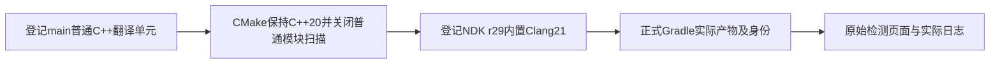

# 源码样本变更

## 遇到的问题

启动倒计时、强制确认及自动弹窗妨碍UI自动化。原版301已有计时失败，原始APK保持。305源码样本在正式MainActivity检查中pagePassed=true，但virtualization_probe子进程被seccomp以SIGSYS、syscall437终止，crashCount=1、anrCount=0，整体退出1，第二轮未执行；独立实例再次运行305仍为crash1、ANR0、退出1。

2026-10-09在macOS26.2 arm64、Apple M1 Max构建登记main源码时，正式app-pre-dist构建在C++依赖扫描阶段退出1，耗时5分2秒；没有产生可验收的Duck APK。原始日志保留于主仓工作根build/nothingphone4a-align/source-build/duck.log，关键原文如下。

```text
Task :app:buildCMakeDebug[arm64-v8a] FAILED
Scanning tee/common/jni_bridge.cpp for CXX dependencies
"CMAKE_CXX_COMPILER_CLANG_SCAN_DEPS-NOTFOUND" -format=p1689 -- .../bin/clang++ ... -std=gnu++20
/bin/sh: CMAKE_CXX_COMPILER_CLANG_SCAN_DEPS-NOTFOUND: command not found
BUILD FAILED in 5m 2s
```

## 定位依据

305样本正式源码构建23秒退出0，versionCode305、101034724字节，SHA-256为cac2df46324c3a3a4205606f4d470b4aa0b9ed58b3a7ad4f6df7abddbc8317bd。两次清数据启动直接进入扫描页；首轮366秒完成，Danger1、Warning0、Ready15、Pending0，自动结果说明及截图提示未出现。手动证书链3张、TEE详情75行可打开并立即退出，设置与手动更新入口可访问。页面成功不能代替子进程及完整检测成功；该样本已卸载，实例正常停止。

派生拒绝涉及arm64的openat2、statx、memfd_create、pidfd_open和renameat2。独立原生程序使用NDK r29内置Clang21，Go通过标准ADB shell在UID2000、SELinux Enforcing下验证，区分已知受限调用、其它受限调用、手动SIGSYS与允许调用；未修改系统seccomp规则。

本机模块扫描失败发生在编译单元编译前。CMakeLists.txt要求CMake4.1.2及C++20，实际NDK为r29 revision29.0.14206865、内置Clang21.0.0，登记NDK的bin目录没有clang-scan-deps。宿主LLVM22组件虽有22.1.8的同名程序，不能混用为NDK21的扫描器。源代码为普通.cpp翻译单元，未发现export module或import声明，CMake未声明CXX_MODULES文件集。[CMake的CXX_SCAN_FOR_MODULES说明](https://cmake.org/cmake/help/latest/prop_tgt/CXX_SCAN_FOR_MODULES.html)规定OFF时停止普通CXX源的模块扫描，CXX_MODULES文件集仍会扫描。

本机失败的完整复现命令在主仓根执行；工具路径由登记CDH_TOOLCHAIN_ROOT提供，输出位于同一工作根，不联网补装编译器或借用其它主版本。

```bash
output/darwin-arm64/bin/cdh app-pre-dist build --project-dir . \
  --output-dir build/nothingphone4a-align/source-build --skip-source play-integrity
"$CDH_TOOLCHAIN_ROOT/ndk29/toolchains/llvm/prebuilt/darwin-x86_64/bin/clang++" --version
find app/src/main/cpp -type f \( -name '*.cpp' -o -name '*.h' \) \
  -exec grep -nHE '^[[:space:]]*(export[[:space:]]+module|module|import)[[:space:]]' {} +
```

最后一条搜索以Duck源码根为工作目录，实际没有命中；上面的构建与版本查询以主仓根为工作目录。完整搜索范围与生成的失败Ninja命令均保留本地，不能把未命中命令的退出1写成程序构建错误。

## 解决方法

启动UI取消使用协议、通知授权、在线CRL授权及应用可见性确认。在线CRL沿用已有设置，首次默认关闭；通知仍按系统实际权限处理，不授予通知权限。删除检测结果说明、截图提示与Alpha自动提示，不执行自动更新检查；手动证书、检测详情及手动更新入口保持。

派生子进程仅为上述五项真实seccomp拒绝安装SIGSYS处理，退出159后父进程保持AVAILABLE1、SUPPORTED0、DISABLED1，第二次调用不再派生。其它SIGSYS恢复原处理，父进程SIGSYS设置、主进程处理、系统seccomp、检测调用、阈值、TEE计时、证书后处理、原生ioctl、扫描调用、报告与风险判定保持上游行为。修改过的超限局部名称缩短，JNI导出名称保留原ABI。检测代码与对应测试已经恢复上游版本。

CMake在创建原生目标前声明CMAKE_CXX_SCAN_FOR_MODULES为OFF，只停止本项目普通翻译单元不需要的模块扫描。C++20、原有编译诊断、ABI、原生来源、检测调用及返回逻辑保持。项目组件版本由VERSION记录；APK名称、versionName、versionCode、签名及构建时间继续由现有Gradle规则生成，不把组件版本当作实际APK身份。

```cmake
set(CMAKE_CXX_STANDARD 20)
set(CMAKE_CXX_STANDARD_REQUIRED ON)
set(CMAKE_CXX_SCAN_FOR_MODULES OFF)
```



## 验证结果

报告79项、私有Binder10项、证书后处理21项、格式化12项、计时阈值7项共129项定向单元测试22秒退出0，失败、错误与跳过均0；缩短UI局部名称后同样129项复测12秒退出0。全套单元测试与原版301计时失败未因此记为通过。

受限调用原生验证的九个子用例退出0，0.841秒。五项已知受限调用均EXIT159、SIGNAL0，其它受限调用及手动SIGSYS均SIGNAL31，允许调用EXIT0，实际生产接口继续保留受限字段。首个额外启用Wall、Wextra的独立编译因原有arm64未使用函数被Werror拒绝；正式构建原有诊断选项保持，按其选项加Werror编译退出0。当时修改后APK构建及页面双轮未执行，不回写为该阶段已经通过。

307样本后续正式构建23秒退出0，101035536字节，SHA-256为c63328989b3300b75f51f60e13fdef399a333cf83a3af66eeedd2ba14363a602。相同MainActivity与自动提示断言两轮退出0，crash及ANR均0，305的同入口失败保留。两次清数据自然扫描均367秒，完成页与报告均Danger1、Warning0、Ready15、Pending0，唯一Danger为TEE；两份报告的虚拟化派生探测均Unsupported，SIGSYS受限说明保持，其它受限Info没有改为Clear。

两轮扫描窗口crash为空、系统lastanr无记录，主进程10871／9954；报告导出、两次UI会话关闭及卸载成功。首个UI选择参数无效，未启动会话，改用标准serial后正常打开。TEE计时与受限字段、无风险双轮及完整应用标准仍未通过，不计TEE修复。

本次CMake模块扫描修正的正式构建及新APK实际运行尚未执行。已完成的是5分2秒构建失败的复现、真实工具版本和来源核对、无模块源及CMake目标配置检查。完整构建受Play Integrity有效HTTPS服务地址缺失影响，--skip-source保留该项未构建状态，其它源码构建结束后仍核对已有产物；不能将排除项或编译配置写入记为全部APK通过。Linux宿主构建及新增Mermaid实际渲染未验证。
